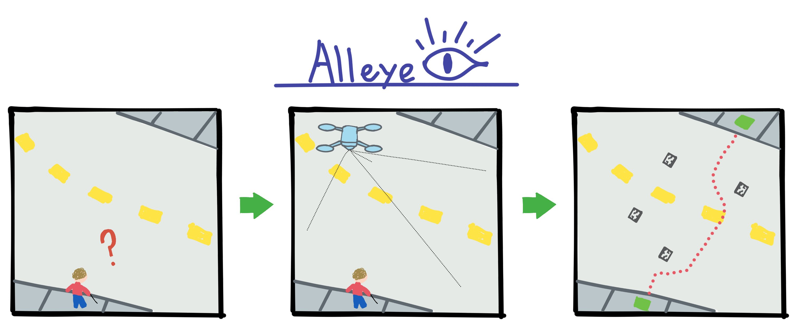

# AllEye
EECE5552 Assistive Robotics Final Project  
Professor Ramezani




## Installation

``` bash
sudo apt install ros-noetic-apriltag-ros
```

## Building

``` bash
catkin build
```

## Running

Run our nodes and start the drone. Remember to always call `source devel/setup.bash`

``` bash
source devel/setup.bash
roslaunch sjtu_drone simple.launch
```

``` bash
source devel/setup.bash
roslaunch alleye start_drone.launch
```

## AprilTag "Generation"

Images from [AprilTag 36h11](https://github.com/AprilRobotics/apriltag-imgs/tree/master/tag36h11)

ImageMagick tool used to scale to correct size. ex:

```bash
convert tag36_11_00000.png -scale 5000% tag36_11_00000_big.png
```